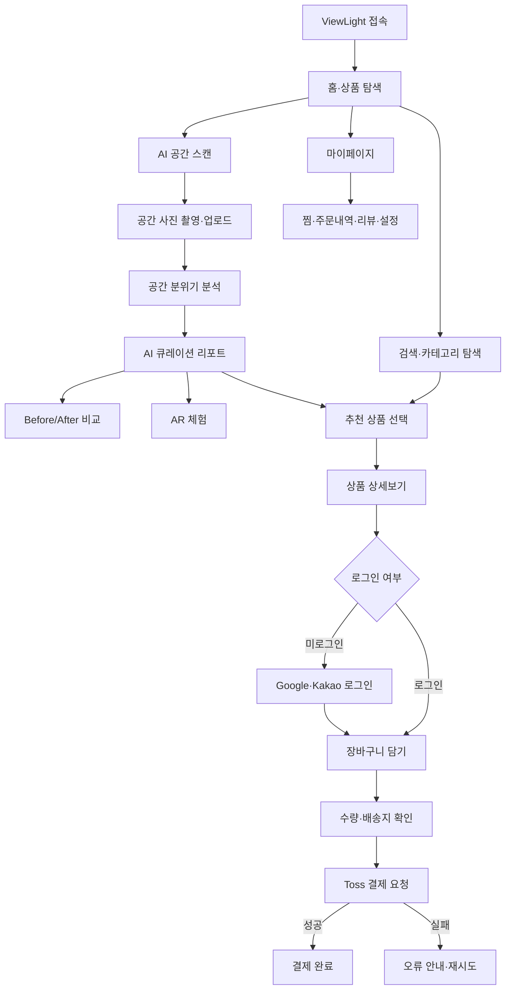

# 💡 ViewLight — AI 공간 분석 기반 무드등 큐레이션

> 공간 사진 한 장으로 어울리는 조명 분위기를 발견하고, Before/After 비교부터 상품 구매까지 연결하는 반응형 이커머스 웹앱

<p>
  
  
  
  
  
  
  
</p>

## 🔗 프로젝트 링크

| 구분 | 링크 |
|---|---|
| 🚀 배포 사이트 | [viewlight.vercel.app](https://viewlight.vercel.app/) |
| 💻 GitHub | [ltn3515-ui/viewlight](https://github.com/ltn3515-ui/viewlight) |
| 📝 Notion 기획서 | [ViewLight 프로젝트 기획서](https://proud-syrup-039.notion.site/3d406f8b2220805cb394dd6977243451?source=copy_link) |

## 🖼️ 주요 화면

<table>
  <tr>
    <th>프로젝트 소개</th>
    <th>Before / After 체험</th>
    <th>AI 큐레이션 리포트</th>
  </tr>
  <tr>
    <td></td>
    <td></td>
    <td></td>
  </tr>
</table>

## 💡 기획 배경

온라인으로 조명을 구매할 때 사용자는 제품 사진만 보고 자신의 공간에서 밝기, 색온도와 분위기가 어떻게 달라질지 판단해야 합니다. ViewLight는 조명을 설치한 뒤의 변화를 구매 전에 시각적으로 경험하고, 공간의 특성에 어울리는 제품을 추천받을 수 있도록 기획한 AI 큐레이션형 이커머스 서비스입니다.

### 핵심 문제

- 제품 사진만으로 실제 공간의 조명 변화를 예측하기 어렵습니다.
- 조도, 색온도와 인테리어 분위기를 일반 사용자가 비교하기 어렵습니다.
- 공간 탐색과 상품 구매가 분리되어 적합한 제품을 찾는 데 시간이 오래 걸립니다.
- 추천 상품을 비교하고 구매하기까지 여러 화면을 반복해서 이동해야 합니다.

### 해결 방향

`공간 촬영 → AI 공간 분석 → 무드 큐레이션 → Before/After·AR 체험 → 상품 선택 → 결제`를 하나의 흐름으로 연결합니다.

## ✨ 주요 기능 & 인터랙션

### 1. 공간 이미지 기반 AI 스캔

사용자가 자신의 공간 이미지를 촬영하거나 업로드하는 카메라 스캔 모달을 제공합니다. 분석 결과에서 자연광, 공간 색조와 분위기를 요약하고 추천 무드 키워드를 제시하도록 구성했습니다. 현재 MVP에서는 분석 과정과 결과 UI를 중심으로 검증하며, 실제 비전 모델 API는 확장 연동 항목입니다.

### 2. AI 무드등 큐레이션 리포트

분석된 공간에 어울리는 조명 제품과 연출 장면을 큐레이션 리포트로 제공합니다. 추천 이유, 색온도·조도 등의 제품 정보와 개별 가격을 확인하고, 추천 상품 세트를 한 번에 장바구니에 담을 수 있습니다.

### 3. Before / After 비교 슬라이더

조명을 적용하기 전과 후의 공간 이미지를 하나의 화면에서 비교할 수 있습니다. 마우스와 터치로 슬라이더를 움직여 조명 변화의 범위를 직접 조절하며 침실, 거실과 다이닝룸의 분위기 차이를 직관적으로 확인합니다.

### 4. AR 체험 진입 흐름

AI 큐레이션 리포트에서 원본 공간과 추천 제품을 확인한 뒤 AR 체험 카메라 화면으로 이동할 수 있습니다. 현재는 카메라·가이드 인터페이스 중심이며, 실제 공간 인식과 3D 조명 배치는 향후 고도화 항목입니다.

### 5. 상품 탐색과 상세 정보

카테고리, 추천 상품, 검색과 상세 모달을 통해 무드등을 탐색합니다. 제품 이미지, 가격, 조명 사양과 추천 설명을 확인하고 찜 목록이나 장바구니에 저장할 수 있습니다.

### 6. 장바구니와 Toss 결제

장바구니에서 상품 수량과 총액을 계산하고 배송지와 결제 방법을 입력합니다. Toss Payments SDK를 사용해 카드·간편결제·계좌이체 요청을 실행하며 결제 성공·실패 페이지를 각각 분리했습니다.

### 7. Google·Kakao 로그인과 마이페이지

Firebase Authentication 기반 Google 로그인과 Kakao JavaScript SDK 로그인 흐름을 제공합니다. 로그인 상태는 사용자 Context와 로컬 저장소에 동기화하며, 마이페이지에서 프로필, 주문내역, 리뷰와 찜 목록을 관리할 수 있습니다.

### 8. 반응형 인터랙션 시스템

모바일 하단 내비게이션과 데스크톱 브랜드 영역을 분리해 화면 크기에 맞는 경험을 제공합니다. 커스텀 마우스 커서, 모달·드로어, 토스트 알림과 카드 인터랙션을 적용해 프리미엄 조명 브랜드의 감성을 강화했습니다.

## 🧭 사용자 플로우



## 🗂️ 폴더 구조

```text
viewlight/
├── img/                              # 레거시 및 공용 조명 이미지
├── org/                              # 기존 HTML·CSS·JS 퍼블리싱 원본
├── public/
│   └── img/                          # Vite 정적 이미지 리소스
├── src/
│   ├── components/
│   │   ├── common/
│   │   │   ├── Header.tsx            # 공통 서비스 헤더
│   │   │   ├── Footer.tsx            # 공통 푸터
│   │   │   ├── BottomNav.tsx         # 모바일 하단 내비게이션
│   │   │   └── CustomCursor.tsx      # 데스크톱 커서 인터랙션
│   │   ├── home/
│   │   │   ├── DesktopBrand.tsx      # 데스크톱 브랜드 소개 영역
│   │   │   ├── HeroBanner.tsx        # 메인 배너
│   │   │   ├── AiScanSection.tsx     # AI 공간 스캔 진입
│   │   │   ├── ProductGrid.tsx       # 상품 목록
│   │   │   ├── TransformationSection.tsx # Before/After 사례
│   │   │   ├── ReviewSection.tsx     # 사용자 리뷰
│   │   │   └── FaqSection.tsx        # 자주 묻는 질문
│   │   └── modals/
│   │       ├── AuthModal.tsx          # 로그인
│   │       ├── CameraScanModal.tsx    # 공간 촬영·분석
│   │       ├── ProductDetailModal.tsx # 상품 상세
│   │       ├── CartDrawer.tsx         # 장바구니
│   │       ├── CheckoutModal.tsx      # 주문·결제
│   │       ├── SearchModal.tsx        # 상품 검색
│   │       └── WishlistModal.tsx      # 찜 목록
│   ├── context/
│   │   ├── AuthContext.tsx            # 로그인·사용자 상태
│   │   ├── CartContext.tsx            # 장바구니·금액 계산
│   │   ├── ModalContext.tsx           # 모달·알림 상태
│   │   ├── ThemeContext.tsx           # 화면 테마
│   │   ├── ToastContext.tsx           # 토스트 메시지
│   │   └── WishlistContext.tsx        # 찜 상태
│   ├── pages/
│   │   ├── HomePage.tsx               # 메인 홈
│   │   ├── CommendPage.tsx            # AI 큐레이션 리포트
│   │   ├── BnaAllPage.tsx             # Before/After 전체보기
│   │   ├── CategoryAllPage.tsx        # 카테고리 전체보기
│   │   ├── FeaturedMorePage.tsx       # 추천 상품 더보기
│   │   ├── MyPage.tsx                 # 마이페이지
│   │   ├── StoryPage.tsx              # 브랜드 스토리
│   │   ├── SplashPage.tsx             # 시작 화면
│   │   ├── PaymentSuccessPage.tsx     # 결제 성공
│   │   └── PaymentFailPage.tsx        # 결제 실패
│   ├── styles/
│   │   ├── GlobalStyle.ts             # 전역·반응형 스타일
│   │   └── theme.ts                   # 색상·간격 디자인 토큰
│   ├── types/
│   │   └── index.ts                   # 공통 TypeScript 타입
│   ├── firebase.ts                    # Firebase Auth 초기화
│   ├── App.tsx                        # Provider·라우터·전역 모달
│   └── main.tsx                       # React 진입점
├── 디자인시안/                        # UI 디자인 시안
├── cursor.js                          # 기존 커서 인터랙션 스크립트
├── script.js                          # 기존 퍼블리싱 스크립트
├── style.css                          # 기존 퍼블리싱 스타일
├── index.html                         # Vite 진입 HTML
├── package.json                       # 스크립트와 의존성
├── tsconfig.json                      # TypeScript 설정
└── vite.config.ts                     # Vite 설정
```

<details>
  <summary><strong>GitHub 저장소 구조 캡처 보기</strong></summary>
  <br />
  
</details>

## 🛠️ 기술 스택

| 구분 | 기술 | 활용 내용 |
|---|---|---|
| Frontend | React 18, TypeScript | 컴포넌트 기반 SPA와 타입 안정성 |
| Build | Vite 5 | 개발 서버와 프로덕션 빌드 |
| Routing | React Router DOM 6 | 큐레이션·비교·마이페이지·결제 라우팅 |
| Styling | styled-components | 전역 테마와 컴포넌트 스타일 |
| State | Context API, localStorage | 인증·장바구니·찜·모달 상태 관리 |
| Auth | Firebase Auth, Kakao SDK | Google·Kakao 로그인 |
| Payment | Toss Payments SDK | 카드·간편결제·계좌이체 요청 |
| Interaction | Pointer/Touch Events | Before/After 슬라이더와 반응형 UI |
| Deploy | Vercel | 자동 빌드와 배포 |

## 🤖 AI 활용 프로세스

ViewLight는 AI를 서비스 기능의 주제로 활용하는 동시에 기획, 디자인과 개발 과정의 협업 도구로 사용했습니다. AI가 만든 결과를 그대로 적용하지 않고 사용자 경험과 실제 코드 동작을 확인한 뒤 직접 수정했습니다.

### ① 기획 — 사용자 문제와 서비스 구조 정의

온라인 조명 구매 과정의 불확실성을 분석하고, 공간 촬영부터 추천과 구매까지 이어지는 기능 우선순위를 정리하는 데 AI를 활용했습니다.

> “사용자가 온라인에서 조명을 구매할 때 겪는 불편을 정리하고, 공간 사진을 활용한 조명 추천 서비스의 MVP 흐름을 설계해줘.”

AI가 제안한 기능 중 초기 구현 범위가 큰 3D 시뮬레이션은 후순위로 조정하고, 공간 분석 결과·Before/After 비교·상품 추천과 구매 흐름을 우선 제작했습니다.

### ② UX/UI — 큐레이션 경험과 브랜드 톤 설계

AI 분석 결과를 전문 용어 중심으로 보여주지 않고 `따뜻한 웜 미니멀리스트`, `부드러운 베이지 톤`처럼 사용자가 이해하기 쉬운 무드 언어로 바꾸는 데 AI 카피 제안을 활용했습니다. 최종 화면은 크림, 차콜과 앰버 컬러를 중심으로 직접 설계했습니다.

### ③ 이미지 콘텐츠 — 조명 변화 시각화

동일 공간의 조명 적용 전후를 설명하는 이미지 콘셉트와 큐레이션 장면 제작에 생성형 AI를 활용했습니다. 생성된 이미지의 밝기와 색조가 지나치게 달라지지 않도록 Before/After 구도와 공간 요소를 비교하며 선별·보정했습니다.

### ④ 개발 — React 컴포넌트와 상태 구조

기존 HTML·CSS·JavaScript를 React, TypeScript와 styled-components로 전환하면서 컴포넌트 분리, Context 구조와 인터랙션 코드의 초안을 AI로 생성했습니다.

> “공간 분석, 상품 상세, 장바구니와 결제 모달을 독립적인 React 컴포넌트로 분리하고 전역 상태의 역할을 나눠줘.”

초기 코드는 모달 중첩과 모바일 스크롤 충돌이 있어 Provider 순서, 오버레이 계층과 스크롤 영역을 직접 수정했습니다.

### ⑤ 트러블슈팅 — 인증·결제·반응형 오류 진단

Firebase 승인 도메인, Kakao JavaScript 키, Vercel 환경 변수, Toss Payments 결과 URL과 TypeScript 빌드 오류를 해결할 때 AI로 원인 후보와 점검 순서를 정리했습니다. 제안된 코드는 실제 콘솔과 빌드 결과를 기준으로 검증했습니다.

### ⑥ AI 기능 확장 — 실제 공간 분석 모델 연결

현재 공간 분석과 AR 체험은 MVP 사용자 흐름을 검증하기 위한 인터페이스 중심입니다. 이후 이미지 분석 API를 연결해 공간 유형, 자연광, 색조와 조명 조건을 판별하고 실제 상품 데이터에 맞는 추천 결과를 반환하도록 확장할 수 있습니다.

## 🩹 트러블슈팅

| 이슈 | 원인 | 해결 |
|---|---|---|
| 모바일에서 Before/After 슬라이더가 움직이지 않음 | 마우스 이벤트만 처리하고 터치 이벤트가 누락됨 | Pointer·Touch 이동 좌표를 동일한 비율 값으로 변환 |
| 서비스 영역 내부 스크롤이 멈춤 | 중첩 flex 컨테이너의 높이 계산 문제 | 스크롤 컨테이너에 `min-height: 0`과 overflow 규칙 적용 |
| 로그인 후 사용자 정보가 유지되지 않음 | Firebase 상태와 로컬 상태의 초기화 시점 불일치 | `onAuthStateChanged`와 localStorage 상태 동기화 |
| Kakao 로그인이 배포 환경에서 실패함 | JavaScript 키 또는 허용 도메인 설정 누락 | 환경 변수와 Kakao 플랫폼 도메인 설정 분리 |
| 결제 완료 후 화면 이동이 실패함 | 성공·실패 URL과 SPA 라우트 불일치 | `/payment/success`, `/payment/fail` 라우트 명시 |
| 상품 아이콘 이름이 커서 문구에 노출됨 | 아이콘 내부 텍스트를 커서가 수집함 | 커서 대상의 텍스트 필터링 및 요소별 레이블 지정 |

## 🚀 로컬 실행 방법

```bash
# 저장소 복제
git clone https://github.com/ltn3515-ui/viewlight.git

# 프로젝트 폴더 이동
cd viewlight

# 패키지 설치
npm install

# 개발 서버 실행
npm run dev
```

Google·Kakao 로그인을 사용하려면 프로젝트 최상위에 `.env` 파일을 만들고 자신의 서비스 키를 입력합니다.

```env
VITE_FIREBASE_API_KEY=your_api_key_here
VITE_FIREBASE_AUTH_DOMAIN=your_project_id.firebaseapp.com
VITE_FIREBASE_PROJECT_ID=your_project_id
VITE_FIREBASE_STORAGE_BUCKET=your_project_id.appspot.com
VITE_FIREBASE_MESSAGING_SENDER_ID=your_messaging_sender_id
VITE_FIREBASE_APP_ID=your_app_id
VITE_FIREBASE_MEASUREMENT_ID=your_measurement_id
VITE_KAKAO_JAVASCRIPT_KEY=your_kakao_javascript_key
```

프로덕션 빌드는 다음 명령어로 확인할 수 있습니다.

```bash
npm run build
npm run preview
```

## 📌 향후 개선 계획

- 실제 이미지 분석 API를 연결한 공간·채광·색조 분석
- 공간 사진 위에 조명을 합성하는 AR·3D 미리보기
- 사용자 행동과 구매 이력을 반영한 개인화 추천
- 실제 상품 데이터베이스와 재고·주문 관리 연동
- Firebase/Firestore 기반 리뷰·주문·찜 데이터 영속화
- 결제 승인용 서버 API와 주문 검증 로직 추가

## 👤 담당 업무

- 서비스 기획 및 사용자 문제 정의
- 사용자 플로우·와이어프레임·UI 디자인
- AI 공간 분석과 큐레이션 경험 설계
- React·TypeScript 프론트엔드 구현
- Firebase·Kakao 로그인 및 Toss Payments 연결
- GitHub 형상관리와 Vercel 배포
- AI 바이브코딩을 활용한 코드 생성·검증·트러블슈팅

## 📄 라이선스

본 프로젝트는 포트폴리오 및 학습 목적으로 제작되었습니다.
